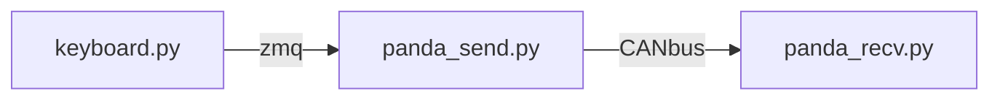

## 模擬

- [manager](./manager.py) : 取代[selfdrvie/manager.py](../selfdrive/manager) 功能，啟動**panda_board.py**, **controlsd.py**, **radard.py** 的腳本

- [panda board](./panda_board.py) : 取代[selfdrive/boardd.py](../selfdrive/boardd/boardd.py) 功能，接收汽車CANbus，發送Openpilot系統CANbus

- [plant honda](./plant_honda.py) : 取代[selfdrive/test/plant/palnt.py](../selfdrive/test/plant/plant.py) 功能，模擬汽車狀態，並且使用CANbus傳輸、接收

- [show logcan](./show_logcan.py) : 接收logcan topic 消息，並顯示在shell 中

  ```mermaid
  graph LR
  manager -- Start --> controlsd.py
  manager -- Start --> radard.py
  manager -- Start --> panda_board.py
  controlsd.py-- logcan topic ---panda_board.py
  radard.py-- radard topic ---panda_board.py
  panda_board.py-- CANbus ---plant_honda.py
  ```


## Panda  send & recv 測試

- [keyboard](./keyboard.py) : 擷取鍵盤w, a, s, d轉換為油門、煞車、方向盤訊號，並發送到`sendcan` topic 

- [panda send](./panda_send.py) : 從`sendcan` topic 接收資料，並透過canbus 傳送控制指令

- [panda recv](./panda_recv.py) : 接收canbus 訊息並透過`plant`模擬汽車狀態



### 改進

- **panda send** : 
  - 改用[carcontroller.py](../selfdrvie/car/honda/carcontroller.py) 方式傳送資料
- **plant honda** : 
  - 須改直接呼叫class方式接收資料